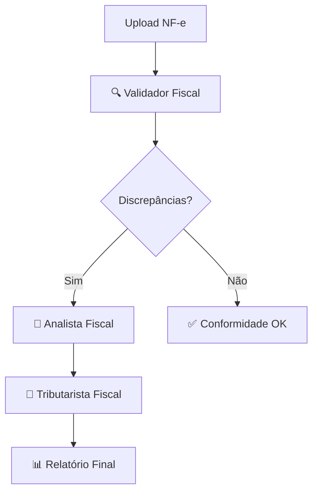

# 🧮 Sistema Tributário IA - Análise Fiscal Inteligente

Uma aplicação web avançada construída com Streamlit para análise tributária automatizada de Notas Fiscais Eletrônicas (NF-e), equipada com três agentes especializados em IA para validação, análise e cálculos fiscais completos.

## 🎯 Visão Geral

Sistema especializado em **regime LUCRO REAL** que automatiza a análise fiscal através de três agentes de IA especializados:

1. **🔍 Validador Fiscal** - Identifica discrepâncias tributárias
2. **🎯 Analista Fiscal** - Analisa problemas e propõe soluções  
3. **🧮 Tributarista Fiscal** - Calcula deltas e multas potenciais

## 🚀 Funcionalidades Principais

### 🔐 **Sistema de Autenticação BYOK**
- **Login seguro** com configuração de LLM personalizada
- **Integração LangChain** para validação robusta de APIs
- **Suporte a múltiplos providers**: OpenAI e Google Gemini
- **Validação automática** de API keys em tempo real
- **Detecção inteligente** do melhor modelo disponível
- **Sistema de fallback** para máxima compatibilidade
- **Armazenamento seguro** apenas na sessão local

### 📊 **Processamento de Documentos**
- **Leitura de arquivos SPED Fiscal (.txt)**: Extrai registros e campos dos blocos SPED
- **Leitura de arquivos NF-e (.xml)**: Extrai informações principais como:
  - Dados do emitente e destinatário
  - Informações da nota fiscal (número, série, data)
  - Lista de produtos/itens
  - Totais e valores

### 🔒 **Criptografia e Segurança**
- **Proteção automática** de dados sensíveis (CPF, CNPJ, valores)
- **Guardrails contra injection** (XSS, SQL, Command injection)
- **Sistema de hash** para busca sem descriptografar
- **Auditoria completa** de operações de segurança
- **Dados criptografados** durante todo o processamento

### 💾 **Exportação e Relatórios**
- **Relatórios executivos** em Markdown
- **Tabelas de dados** em CSV/Excel
- **Dashboards interativos** com métricas fiscais
- **Downloads múltiplos** por tipo de conteúdo
- **Visualização protegida** com dados mascarados

## 🏗️ Arquitetura do Sistema

### 🔄 **Fluxo de Trabalho dos Agentes**



### 🧩 **Componentes Principais**

```
Sistema/
├── view/                    # Interface Streamlit
│   ├── main.py             # Dashboard principal
│   ├── login.py            # Sistema de autenticação
│   └── welcome.py          # Página de boas-vindas
├── agents/                  # Agentes IA especializados
│   ├── validador.py        # 🔍 Validador Fiscal
│   ├── analista.py         # 🎯 Analista Fiscal
│   └── tributarista.py     # 🧮 Tributarista Fiscal
├── assets/                  # Recursos e configurações
│   └── banco_de_regras.json # Base de conhecimento fiscal
├── criptografia.py         # Sistema de segurança
├── utils.py                # Utilitários gerais
└── app.py                  # Ponto de entrada principal
```

## 📋 Pré-requisitos

- **Python 3.8+** com pip
- **API Key** de um dos provedores:
  - 🔵 **OpenAI**: GPT-4o, GPT-4-turbo, GPT-3.5-turbo
  - 🟢 **Google Gemini**: Gemini-2.0-flash, Gemini-1.5-pro, Gemini-1.5-flash
- **Conhecimento básico** de tributação brasileira (regime Lucro Real)

## 🔧 Instalação Rápida

### 1. **Clone e Configure**
```bash
git clone <repository-url>
cd extrator_xml
pip install -r requirements.txt
```

### 2. **Configure Ambiente**
```bash
# Opcional: Criar ambiente virtual
python -m venv .venv
.venv\Scripts\activate  # Windows
source .venv/bin/activate  # Linux/Mac
```

### 3. **Execute o Sistema**
```bash
streamlit run app.py
```

## ▶️ Como Usar

### **� 1. Autenticação (BYOK)**

1. **Acesse o sistema**: `streamlit run app.py`
2. **Configure identidade**: Nome e dados básicos
3. **Escolha provider**: OpenAI ou Google Gemini
4. **Insira API Key**: Sua chave pessoal
5. **Validação automática**: Sistema detecta melhor modelo
6. **Acesso liberado**: Dashboard principal disponível

### **📊 2. Análise Fiscal Completa**

#### **Passo 1: Upload da NF-e**
- Arraste arquivo XML da NF-e para a área de upload
- Sistema extrai automaticamente dados tributários
- Visualize dados criptografados na interface

#### **Passo 2: Validação Fiscal** 
- Clique em "🔍 Validar NF-e"
- Agente Validador analisa impostos e alíquotas
- Identifica discrepâncias e oportunidades
- Apresenta relatório de conformidade

#### **Passo 3: Análise Detalhada** (se houver discrepâncias)
- Botão "🎯 Analisar Discrepâncias" aparece automaticamente
- Agente Analista investiga problemas encontrados
- Propõe soluções específicas para cada caso
- Gera plano de ação consolidado

#### **Passo 4: Cálculo Tributário** (após análise)
- Botão "🧮 Calcular Delta" é habilitado
- Agente Tributarista calcula diferenças tributárias
- Computa multas potenciais conforme legislação
- Apresenta relatório híbrido com tabelas e análises

### **📥 3. Downloads e Relatórios**

- **📄 Relatório Completo**: Markdown com toda a análise
- **📊 Tabelas de Dados**: CSV com valores e cálculos
- **📈 Dashboard**: Métricas e indicadores visuais
- **🔒 Logs de Segurança**: Auditoria de operações

## 🔑 Configuração de API Keys

### **🔵 OpenAI**
```bash
# Acesse: https://platform.openai.com/api-keys
# Crie nova API Key
# Cole no sistema durante login
```

### **🟢 Google Gemini**
```bash
# Acesse: https://makersuite.google.com/app/apikey
# Gere nova API Key  
# Configure no sistema de login
```

## 📊 Funcionalidades por Agente

### 🔍 **Validador Fiscal**

#### **Impostos Analisados:**
- **ICMS**: Alíquotas internas/interestaduais, ST, DIFAL
- **PIS/COFINS**: Regime não cumulativo (Lucro Real)
- **IPI**: Produtos tributados conforme TIPI
- **Outros**: Contribuições federais quando aplicáveis

#### **Validações Realizadas:**
- ✅ Alíquotas corretas por UF e produto
- ✅ Bases de cálculo apropriadas
- ✅ Aplicação de benefícios fiscais
- ✅ Operações internas vs. interestaduais
- ✅ Classificação fiscal (NCM/CFOP)

### 🎯 **Analista Fiscal**

#### **Análises Produzidas:**
- � **Investigação detalhada** de cada discrepância
- 💡 **Soluções específicas** para problemas identificados
- ⚠️ **Avaliação de riscos** tributários
- 📋 **Plano de ação** priorizado
- 🎯 **Oportunidades** de economia fiscal

#### **Relatórios Gerados:**
- **Relatório Executivo**: Visão geral para gestores
- **Análise Técnica**: Detalhes para equipe fiscal
- **Plano de Ação**: Tarefas específicas a executar

### 🧮 **Tributarista Fiscal**

#### **Cálculos Realizados:**
- 💰 **Delta Tributário**: Diferença entre pago vs. devido
- ⚠️ **Multas Potenciais**: Conforme legislação vigente
- 📊 **Exposição Total**: Valor em risco
- 🎯 **Análise de Impacto**: Consequências financeiras

#### **Relatório Híbrido:**
- **📊 Tabelas**: Valores numéricos organizados
- **📝 Análises**: Explicações e contexto
- **⚠️ Alertas**: Riscos críticos destacados
- **💡 Recomendações**: Ações sugeridas

## 🛡️ Segurança e Compliance

### **🔒 Proteção de Dados**
- **Criptografia AES-256** para dados sensíveis
- **Mascaramento automático** na interface
- **Logs de auditoria** completos
- **Validação de entrada** contra injections

### **⚖️ Compliance Fiscal**
- **Base atualizada** da legislação brasileira
- **Tabelas de multas** vigentes
- **Alíquotas por UF** sempre atualizadas
- **Validação contra** Receita Federal

### **� Privacidade**
- **Processamento local** dos dados
- **API Keys** armazenadas apenas na sessão
- **Dados temporários** limpos automaticamente
- **Conformidade LGPD**

## 🎛️ Configurações Avançadas

### **⚙️ Parâmetros do Sistema**
```python
# Configurações em assets/banco_de_regras.json
{
  "regime_tributario": "LUCRO_REAL",
  "uf_origem": "SP",
  "validacao_detalhada": true,
  "calcular_multas": true,
  "gerar_relatorio_executivo": true
}
```

### **🔧 Personalização de Agentes**
- **Prompts especializados** por área fiscal
- **Temperaturas otimizadas** para precisão
- **Fallbacks automáticos** entre modelos
- **Caching inteligente** de respostas

## 📈 Métricas e KPIs

### **📊 Indicadores Monitorados**
- **Taxa de conformidade** fiscal
- **Valor médio** de discrepâncias encontradas
- **Tempo médio** de análise por NF-e
- **Economia fiscal** identificada
- **Riscos mitigados** por período

### **🎯 Alertas Automáticos**
- 🚨 **Risco Alto**: Multas > R$ 10.000
- ⚠️ **Risco Médio**: Discrepâncias > 5%
- 💡 **Oportunidades**: Economia > R$ 1.000

## 🔧 Desenvolvimento e Customização

### **🛠️ Tecnologias Utilizadas**
- **Frontend**: Streamlit (Python)
- **IA/ML**: LangChain + OpenAI/Gemini
- **Processamento**: Pandas + NumPy
- **Segurança**: Cryptography + Fernet
- **Dados**: XML parsing + JSON storage

### **🔌 APIs Integradas**
- **OpenAI**: GPT-4o, GPT-4-turbo
- **Google**: Gemini-2.0-flash, Gemini-1.5-pro
- **Receita Federal**: Consultas de CNPJ (futuro)
- **SEFAZ**: Validação de NF-e (futuro)

### **🚀 Roadmap de Funcionalidades**

#### **Próximas Versões:**
- 📱 **App mobile** para auditores
- � **API REST** para integração
- 📊 **Dashboard BI** avançado
- 🤖 **Agent de Compliance** automatizado
- 📈 **Análise de tendências** fiscais
- 🔄 **Integração ERP** empresariais

## 🆘 Suporte e Troubleshooting

### **❓ Problemas Comuns**

#### **🔑 Erro de API Key**
```bash
❌ Erro: API Key inválida
✅ Solução: Verifique key no provider e tente novamente
```

#### **📁 Erro de Upload**
```bash
❌ Erro: Arquivo XML inválido
✅ Solução: Use apenas arquivos NF-e válidos
```

#### **🧮 Erro de Cálculo**
```bash
❌ Erro: Format code 'f' for object of type 'str'
✅ Solução: Atualizado com conversão automática de tipos
```

### **🔧 Debug Mode**
```bash
# Ativar logs detalhados
streamlit run app.py --logger.level=debug
```

### **📞 Contato e Suporte**
- **GitHub Issues**: Para bugs e melhorias
- **Documentação**: Wiki completa no repositório
- **Community**: Fórum de usuários especializados

---

**🧮 Desenvolvido com foco em precisão fiscal e conformidade tributária**  
*Sistema especializado em regime LUCRO REAL - Sempre valide resultados com profissional contábil*

**Última atualização**: Outubro 2025 | **Versão**: 2.0.0 | **Licença**: MIT


